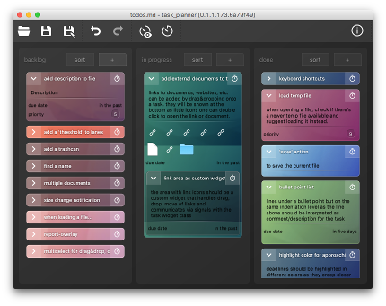
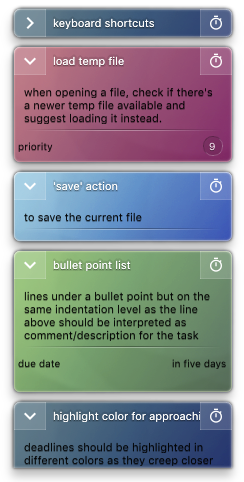

# taskplanner
task planning tool



A tool that lets you organize tasks in lanes and keeps track of time spent in tasks.
The tasks are yours. No account, no login, no cloud, no internet.

## Features



 * Kanban-style board that lets you move tasks between user-definable lanes
 * Create tasks with short descriptive text
 * Add tasks to other tasks to create sub-tasks
 * Add links to local files or URLs to websites to tasks
 * Track time spent with a task
 * Generate weekly time-sheet reports 
 * Add properties such as due date, priority, estimated duration to tasks
 * Automatically sort taks based on property values
 * Customizable user interface via CSS
 * [planned] plugin-based support for saving/loading different file formats
 * [planned] plugin-based support for generating reports
 * everything is kept 100% offline. noCloud™-technology


## Requirements

 * Qt 5 (built using Qt 5.4.2, might work with older versions)
 * QtCreator IDE (pro-file supplied, project files of other IDEs might come at a later date)
 * C++11 compliant compiler

## CSS documentation
The look of the application can be changed via stylesheet.
If there's a file called "stylesheet.css" in the application executable directory, the application will load it at startup.

If a stylesheet from any other location should be used, it can be loaded via "Tools->Options->Stylesheet…". Once selected, the new stylesheet is loaded and its path is stored in the application settings from where it will be reloaded automatically on the next restart.

## Example

Shown below are only custom classes and named objects. Available css properties and styling of any other Qt classes can be looked up in the official Qt documentation [here](https://doc.qt.io/qt-5/stylesheet.html).
```css
MainWindow {
  /* the application main window */
}

MainWindow #frame {
  /* the central widget of the main window, without 
     toolbar, statusbar, menu */
}

WindowTitleMenuBar {
  /* the window title bar, containing menus, title, 
     maximize, minimize and close buttons */
}

OverlayWidget {
  /* the overlay class used to show 'popup' dialogs
     such as the report view or the about dialog */
}

OverlayWidget > #pClose {
  /* the close button of the overlay. QPushButton. */  
}

#ReportDialog #report {
  /* the OverlayWidget showing the report */
}

#AboutDialog {
  /* the OverlayWidget showing app information */
}

#AboutDialog #pContents {
  /* centered content of the about dialog */
}

#AboutDialog #pAppIcon {
  /* the application icon in the about dialog */
}

#AboutDialog #pAppName {
  /* the application name in the about dialog */
}

#AboutDialog #pCopyright {
  /* the copyright notice in the about dialog */
}

#pInsertTask {
  /* the OverlayWidget that is showin when inserting a new task */
}

#pInsertTask TaskWidget {
  /* the task widget preview shown in the "insert task" dialog */
}

#pInsertTask #pOk{
  /* the ok QPushButton in the "insert task" dialog */
}

#pInsertTask #pCancel {
  /* the cancel QPushButton in the "insert task" dialog */
}

DecoratedLabel {
  /* a label class with two custom properties to finetune
     text rendering. */
  /* property to determine whether text should show a dropshadow */
  qproperty-drawShadow: false; 
  /* property to determine whether text should show an outline */
  qproperty-drawOutline: false;
}

EditableLabel {
  /* any label that is editable via double-click.
     Inherits DecoratedLabel. */
}

GroupWidget {
  /* the lane in which task widgets are kept */
}

GroupWidget > #pTitle {
  /* the title of a group widget. EditableLabel. */
}

GroupWidget > #pAddTask {
  /* the + button that adds a new task to the group. */
}

GroupWidget > #pSortTasks {
  /* the "sort" button that adds a new task to the group. */
}

TaskWidget,
TaskWidget[expanded=true],
TaskWidget[expanded=false] {
  /* the task widget class */
}

TaskWidget #pShadow {
  /* the application main window */
}

TaskWidget #pFrame {
  /* a frame around the content of a task widget that can 
     be used to display a drop shadow or border effect */
}

TaskWidget #pTitle {
  /* the title of a task widget. EditableLabel. */
}

TaskWidget #pLinks {
  /* the area that displays links stuck to a task widget. QFrame. */
}

TaskWidget #pDescription {
  /* the label that holds the description of a task. EditableLabel. */
}

TaskWidget #pShowDetails {
  /* the "expand/collapse" button of a task widget. QPushButton. */
}

TaskWidget #pStartStop {
  /* the "start/stop time tracking" button of a task widget. QPushButton. */
}

TaskWidget #pProperties {
  /* a QFrame around all the properties of a task widget. */
}

TaskWidget #pDynamicProperties {
  /* a QFrame that contains links, description and a separator.
     Child of #pProperties. */
}

TaskWidget #pSeparator {
  /* a horizontal line that separates description from links */
}

TaskWidget #pPropertyFrame {
  /* a QFrame containing label and value of a property. */
}

TaskWidget #[property_name]_label {
  /* the label area of a property */
}

TaskWidget #[property_name]_value {
  /* the display area of the value of a property */
}

TaskWidgetOverlay,
TaskWidgetOverlay[autoPriority="10"]{
  /* the overlay of a task widget. 
     can be used to mark a task widget based on its autoPriority.
     autoPriority values range from 0 to 10
  */
  /* TaskWidgetOverlay has the custom property "background" 
     that can be used to change the background color.
     Any other css properties should work too, but 
     if the background-property (below) is used, the app
     smoothly blends colors into each other */
  qproperty-background: rgba(255, 255, 255, 0);
}

LinkWidget,
LinkWidget[isFile=true],
LinkWidget[isFile=false] {
  /* a widget used to display a link. Inherits QFrame. */
}

LinkWidget #pIcon {
  /* the icon used to symbolize a link. If the link points
     to an accessible file, its icon will be displayed.
     If the link is not a file, #pIcon can be used to display
     a custom "link" icon.
  */
}

ToolBarInfoDisplay {
  /* an area in the toolbar that displays various information. */
}

TaskListWidget {
  /* the list of tasks within a group widget or the list of sub-tasks
     within a task widget. Inherits QFrame. */
}
```

